# OpenVB6toCS — Translation Pipeline Architecture

This document describes the full translation pipeline from VB6 source to C# output.

```mermaid
%%{init: {"flowchart": {"htmlLabels": false}} }%%
flowchart TD
    INPUT([".vbp / .cls / .bas\ninput file"]) --> DISPATCH

    DISPATCH{Input type?}
    DISPATCH -->|".vbp project"| S0
    DISPATCH -->|".cls / .bas single file"| S1

    %% ── Stage 0: Project Reader ───────────────────────────────────────────────
    subgraph S0["Stage 0 — VBP Project Reader"]
        VBP_LINE{Line type?}
        VBP_LINE -->|"Class= / Module="| ADD_SRC[Add to source file list]
        VBP_LINE -->|"Form= / UserControl="| SKIP_UI[Skip — warn user\nUI out of scope]
        VBP_LINE -->|"Reference= COM lib"| COM_TIER
        VBP_LINE -->|"Name= / ExeName32="| PROJ_NAME[Record project name]

        COM_TIER{COM mapping tier}
        COM_TIER -->|"Known .NET equiv\ne.g. Scripting.Dictionary"| COM_MAP[Translate silently\ne.g. → Dictionary&lt;K,V&gt;]
        COM_TIER -->|"Unknown COM type"| COM_INTEROP[COM Interop fallback\nadd &lt;COMReference&gt; to .csproj\nannotate usage with INTEROP:]
    end

    ADD_SRC --> S1

    %% ── Stage 1: Lexer ────────────────────────────────────────────────────────
    subgraph S1["Stage 1 — Lexer"]
        LEX[Tokenise source text\nhand-written scanner]
        LEX --> OPT_EXP{Option Explicit\npresent?}
        OPT_EXP -->|No| REJECT[Reject file\nwith clear error]
        OPT_EXP -->|Yes| TOK_LIST[Token list]

        LEX_NOTES["Special handling:\n• Line continuation _ → silent\n• Type suffixes %&amp;!#@$ → consumed, not appended\n• &amp;H1F hex → 0x1F\n• #date# → DateLiteralToken\n• ! followed by letter → BangToken\n• Comments → preserved as tokens"]
    end

    TOK_LIST --> S2

    %% ── Stage 2: Parser ───────────────────────────────────────────────────────
    subgraph S2["Stage 2 — Recursive Descent Parser"]
        PARSE[Parse token stream\ninto typed AST]
        PARSE --> AST["ModuleNode root\n59 AST node types"]

        PARSE_NODES["Node categories:\n• Declarations: Field, Const, Enum, UDT, Implements\n• Procedures: Sub, Function, Property Get/Let/Set\n• Statements: If, Select, For, ForEach, While, Do,\n  With, OnError, GoTo, Label, Dim, Assignment, Call\n• Expressions: BinaryExpr, UnaryExpr, MemberAccess,\n  BangAccess, CallOrIndex (ambiguous), NewObject, …\n• Literals: Integer, Double, String, Bool, Date, Nothing"]
    end

    AST --> S3

    %% ── Stage 3: Semantic Analysis ────────────────────────────────────────────
    subgraph S3["Stage 3 — Semantic Analysis (3 passes)"]
        P3_1["Pass 1 — Build module symbol table\nAll declarations → SymbolTable\nOne entry per field / method / property / enum / UDT"]
        P3_2["Pass 2 — Transform bodies\n• CallOrIndexNode → IndexNode  (known arrays)\n• FunctionName = value → FunctionReturnNode\n• Identifier casing normalised to declaration site"]
        P3_3["Pass 3 — Property grouping\nProperty Get + Let + Set triads\n→ single CsPropertyNode"]
        P3_1 --> P3_2 --> P3_3

        COLL_INF["CollectionTypeInferrer\n(cross-module, runs after all Pass 1s)\nInfers Collection element type from .Add call sites\n→ collectionTypeMap: (module,field) → elemType"]
    end

    P3_3 --> MAPS
    COLL_INF --> MAPS

    %% ── Cross-module maps ─────────────────────────────────────────────────────
    subgraph MAPS["Cross-module Map Building (Program.cs)"]
        MAP1["collectionTypeMap\n(module,field) → elemType"]
        MAP2["enumMemberMap\nmemberName → (module,enumName)"]
        MAP3["enumTypedFieldNames\nfield names whose type is an enum"]
        MAP4["enumTypeMap\nenumTypeName → moduleName"]
        MAP5["methodParamMap\nmodule → method → ParameterMode list"]
        MAP6["globalVarMap\nfieldName → typeName  (public fields)"]
    end

    MAPS --> S4

    %% ── Stage 4: IR Transformation ────────────────────────────────────────────
    subgraph S4["Stage 4 — IR Transformation (2 passes)"]
        T4_1["Pass 1 — Type normalisation\nString→string  Long→int  Boolean→bool\nDate→DateTime  Currency→decimal  Variant→object\nVB6 intrinsic enums (VbMsgBoxStyle etc.) → int\nApplied to ALL TypeRefNode instances"]

        T4_2["Pass 2 — Error handling restructuring"]
        T4_1 --> T4_2

        EH_DETECT{Structured pattern\ndetected?}
        T4_2 --> EH_DETECT

        EH_DETECT -->|"Yes — canonical\nOn Error GoTo / cleanup label / error label"| EH_CONVERT

        subgraph EH_CONVERT["Structured conversion"]
            TRY_BODY["try body = statements before cleanup label"]
            CATCH_BODY["catch body = error handler block"]
            FINALLY_BODY["finally body = cleanup label block"]
            GOTO_THROW["GoTo errLabel inside try body\n→ ThrowNode  (throw new Exception)"]
            TRY_BODY --- CATCH_BODY --- FINALLY_BODY --- GOTO_THROW
        end

        EH_DETECT -->|"No — multiple handlers /\nResume / complex flow"| EH_PRESERVE["Preserve as structured comments\nfor manual developer review"]
    end

    EH_CONVERT --> S5
    EH_PRESERVE --> S5
    T4_1 --> S5

    %% ── Stage 5: Code Generation ──────────────────────────────────────────────
    subgraph S5["Stage 5 — C# Code Generation"]

        subgraph MEMBER_GEN["Module member emission"]
            MG_FIELD["FieldNode → public/private field\nwith C# type"]
            MG_ENUM["EnumNode → public enum Name : int\nMember qualif.: same module → EnumName.M\ncross-module → ModuleName.EnumName.M"]
            MG_UDT["UdtNode → public struct"]
            MG_SUB["SubNode → void method\n(.bas module → static)"]
            MG_FUNC["FunctionNode → typed method\n_result local + return _result pattern\nReturn type inferred when declared As Variant\nand all return expressions share one type"]
            MG_PROP["CsPropertyNode → { get; set; } property\nor split get/set if asymmetric"]
            MG_DECL["Declare Sub/Function → [DllImport] extern"]
        end

        subgraph STMT_GEN["Statement branches"]
            ST_TRYCATCH["TryCatchNode → try/catch/finally"]
            ST_THROW["ThrowNode → throw new Exception()"]
            ST_ONERR["OnErrorNode → // VB6: On Error ... comment"]
            ST_FOREACH["ForEachNode → foreach\n(Dictionary → .Values appended)"]
            ST_WITH["WithNode → using _withStack\n(nested With supported via Stack&lt;string&gt;)"]
            ST_SELECT["SelectCaseNode → switch\nCaseIs → relational case\nCaseRange → case x when val >= lo && val <= hi"]
            ST_ASSIGN["AssignmentNode\nSet obj = ... → plain assignment\nLet primitive = ... → plain assignment"]
            ST_REDIM["ReDimNode → arr = new T[n]"]
        end

        subgraph EXPR_GEN["Expression branches"]
            EX_BANG["BangAccessNode (obj!Key)\n→ resolve obj type → look up default member\n→ obj.Fields(@'Key') for Recordset\nor obj[@'Key'] fallback"]
            EX_FIELDS["Fields() / BangAccess in typed context\n→ Convert.ToDouble() / Convert.ToInt32() / etc.\nbased on LHS type"]
            EX_CALL["CallOrIndexNode\n• COM indexed member → obj[args]\n• ByRef params → ref prepended\n• Optional trailing args → omitted\n• Optional middle args → named + default"]
            EX_ENUM["Enum member identifier\n→ qualified via enumMemberMap"]
            EX_TYPE["TypeStr()\n→ cross-module enum type → ModuleName.Type\n→ VB6 Collection → Collection&lt;T&gt; or Dictionary&lt;string,T&gt;\n→ built-in type map (Long→int, etc.)"]
            EX_BUILTIN["Built-in functions\nCStr→.ToString()  CInt→Convert.ToInt32()\nLeft/Right/Mid/InStr → string methods\nIIf→ternary  Nz→??  Len→.Length"]
        end

    end

    S5 --> S6

    %% ── Stage 6 / Output ──────────────────────────────────────────────────────
    subgraph S6["Output"]
        CS_FILES[".cs files\none per source module"]
        CSPROJ[".csproj\nSDK-style, net8.0, Library\n+ &lt;COMReference&gt; for unmapped COM libs"]
        ROSLYN["Stage 6 — Roslyn formatting\n(planned — normalise whitespace and style)"]
        CS_FILES --> ROSLYN
    end

    CSPROJ --> DONE([Build-ready C# project])
    ROSLYN --> DONE
```

## Pipeline stages summary

| Stage | Component | Description |
|---|---|---|
| 0 | `VbpReader` + `CsprojWriter` | Reads `.vbp` project, classifies source files, writes SDK `.csproj` |
| 1 | `Lexer` | Hand-written VB6 tokeniser; enforces `Option Explicit` |
| 2 | `Parser` | Recursive descent, produces 59-node typed AST |
| 3 | `Analyser` + `CollectionTypeInferrer` | Symbol table, type resolution, property grouping, Collection element inference |
| — | Map builders (`Program.cs`) | Six cross-module maps linking all 3+ modules |
| 4 | `Transformer` | Type normalisation + structured error-handling conversion |
| 5 | `CodeGenerator` | AST → C# source text with all cross-module resolution |
| 6 | Roslyn formatter | *(Planned)* Normalise whitespace and style |

## Key design decisions

- **No external parser library.** Pure hand-written C# recursive descent — no ANTLR, no YAML, no Java toolchain.
- **Records for all AST nodes.** `abstract record AstNode` gives free value equality and clean `with`-expression transforms.
- **`CallOrIndexNode` ambiguity resolved in Stage 3.** `foo(x)` is lexically ambiguous between a call and an array index; the symbol table resolves it.
- **Error handling pattern detection.** Seven structural checks validate the canonical `On Error GoTo / cleanup label / error label` shape before converting. Patterns that fail any check are preserved as comments.
- **`GoTo ErrorHandler` → `throw new Exception()`.** Recursive replacement of `GoTo errLabel` nodes inside the try body; handles the common VB6 validation pattern (`If condition Then GoTo ErrorHandler`).
- **Cross-module maps.** Six maps built once after Stage 3 and passed into Stage 5 to resolve enum members, parameter modes, collection types, and field types across all modules without a global type registry.
